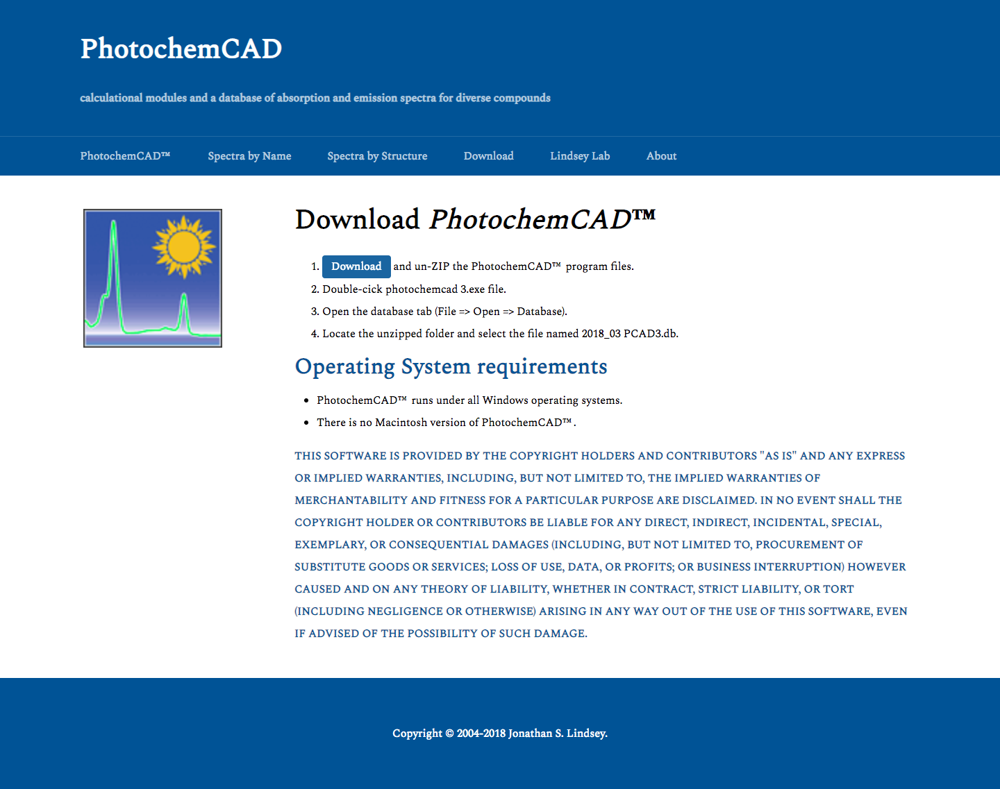

# Photochemcad 2.0 🔅

[Old website](http://www.photochemcad.com/photochemcad_server_backup_20180814/index.html) for photochemcad is a static version with hundreds of pages built mannually and no backend database. The new version [Photochemcad 2.0](http://www.photochemcad.com/) started 
from scratch, used modern web responsive design and built both frontend as well as backend. All 339 compounds' information were migrated to MySQL tables, including data source from excel files as well as web scraping from the old website via *XPath* by Python.

## Technology Stack

PHP, MySQL, HTML5, CSS3, JQuery, AJAX, Echarts, XAMPP. 

## Design Principle

This website's stakeholder is Professor Jonathan Lindsey and his team, and target users are mainly chemists in photochem fields. In the design process, I put users in the first place, abandoned bulky styles and only emphasize important information in the straightforward and academic way. Also, I followed rule of agile development, adjusting website style as well as functiosn as the requirements from the stakeholder evolved. 

## Website at A Glance

1. Homepage. This page was initially designed without the four cards below because this may cause repetition with the navigation bar. While the stakeholder required to use this way to emphasize. 
 

2. Compounds by name. 
 
  * On the left side, there is a sidebar menu showing all classes of compounds. By clicking a class name, all compounds will show, by clicking again, compounds below will wrap up. 
  
  * On the right side, there is a table showing all compounds at default to fulfill the requirements of the stakeholder. To improve the usability by reducing users' scrolling task, a selection to change entries per page to 25, 50, 100 is provided.
  
  * Users can sort all records by click the header of a column. Click once you get new ordered list from large to small, and click again to get list from small to large.
  
  * Users can search by their interested keywords. By *AJAX* the search results will change as user inputs character by character.
 

3. Compounds by structure. This page was added later as user requirements changed. Still in a format of dropdown list, all categories are unwrapped at first so that the users, who are familiar with chemistry, can browse compound structures directly.
 

4. Compound detail. This part was initially designed as a partial refresh of the page by *AJAX* while the stakeholder requested to have different urls for each compound so that users can cite a certain compound by the link. As the result, compound name is included in the url and used as a *$_GET* parameter. 
 

 5. Compound spectrum. The absorption spectrum and fluorescence spectrum are combined into one graph based on ECharts JavaScript library.
 

 6. Download. This page provides download link as well as install guidance for PhotochemCAD™.

 7. About. This page introduces backgrdound and version history for PhotochemCAD™.
 

## Paper

A paper *Developing a user community in the photosciences.A website for spectral data and access to PhotochemCAD* was published on [SPIE](https://www.spiedigitallibrary.org/conference-proceedings-of-spie/10893/108930O/Developing-a-user-community-in-the-photosciences--a-website/10.1117/12.2508077.short?SSO=1). Yaxue Guo and Zhen Xu are first co-authors. Ann Elizabeth Norcross,
Masahiko Taniguchi, and Jonathan S. Lindsey are second co-authors.

## Authors

 * **Yaxue Guo** designed, developed and deployed whole website except for the spectrum chart, and integrated this chart into compound detail page.
 
 * **Zhen Xu** developed the spectrum chart for the compound detail page.
 
## Acknowledgement

 * PhotochemCAD™, PorphyrinViLiGe™, and Cyclaplex™ were developed by Jonathan Lindsey and his coworkers, particularly Masahiko Taniguchi and Hai Du. All data used in this website is credit to Professor [Jonathan Lindsey's Lab](https://sites.google.com/a/ncsu.edu/lindsey-lab/). 
